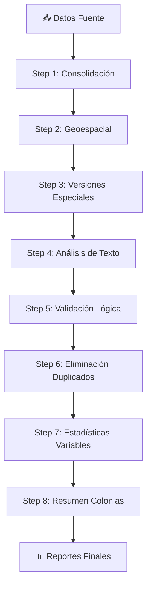

# 🏠 ESDATA_Epsilon - Pipeline Inmobiliario Inteligente

## 📋 Descripción

ESDATA_Epsilon es un **pipeline completo de procesamiento de datos inmobiliarios** que automatiza la consolidación, estandarización, validación, análisis geoespacial y generación de reportes para propiedades inmobiliarias en Guadalajara y Zapopan, México.

El sistema procesa datos de múltiples fuentes (principalmente Inmuebles24) y los transforma en información estructurada y confiable para análisis de mercado inmobiliario.

## 🚀 Características Principales

### 🔄 **Pipeline Automatizado**
- **8 pasos secuenciales** de procesamiento de datos
- **Logging comprehensivo** con emojis y estadísticas detalladas
- **Validación automática** en cada etapa
- **Manejo de errores** robusto con archivos de respaldo

### 🗺️ **Análisis Geoespacial**
- **Asignación automática** de colonias usando polígonos GeoJSON
- **Validación de coordenadas** y detección de inconsistencias
- **Corrección de ubicaciones** basada en geometrías precisas
- **Cobertura completa** de 1,062 colonias en ambas ciudades

### 💰 **Procesamiento de Precios**
- **Extracción inteligente** de precios con múltiples formatos
- **Conversión automática** USD → MN (1 USD = 20 MN)
- **Validación por rangos** específicos por tipo de propiedad
- **Detección de outliers** y valores atípicos

### 📊 **Análisis Estadístico**
- **Estadísticas descriptivas** exhaustivas
- **Detección automática** de tipos de variables
- **Análisis de normalidad** y distribuciones
- **Reportes por colonias** con métricas especializadas

### 🎯 **Control de Calidad**
- **Filtrado lógico** por tipo de propiedad y operación
- **Eliminación de duplicados** con criterios jerárquicos
- **Validación cruzada** de consistencia de datos
- **Reportes de propiedades** problemáticas

## 🏗️ Arquitectura del Pipeline



### 📝 **Descripción Detallada de Pasos**

| Paso | Nombre | Descripción | Entrada | Salida |
|------|--------|-------------|---------|---------|
| **1** | Consolidación y Adecuación | Unifica archivos CSV, normaliza columnas, estandariza valores, extrae precios USD/MN | Múltiples CSV | `1.Consolidado_Adecuado_*.csv` |
| **2** | Procesamiento Geoespacial | Asigna colonias y ciudades usando GeoJSON, valida coordenadas | Consolidado | `2.Consolidado_ConColonia_*.csv` |
| **3** | Versiones Especiales | Genera versiones filtradas para análisis específicos | Con Colonias | Versiones especializadas |
| **4** | Análisis de Texto | Procesa variables textuales, extrae características | Versiones | Texto procesado |
| **5** | Validación Lógica | Aplica filtros de calidad por tipo de propiedad y operación | Texto | `Final_Num_*.csv` |
| **6** | Eliminación Duplicados | Remueve duplicados con criterios jerárquicos, mantiene consistencia | Validado | `Final_*_*.csv` (3 archivos) |
| **7** | Estadísticas Variables | Calcula estadísticas descriptivas por variable | Final | Reportes estadísticos |
| **8** | Resumen Colonias | Genera reportes por colonia, tablero maestro, puntos finales | Estadísticas | Reportes por colonia |

## 🛠️ Instalación y Configuración

### ✅ **Prerrequisitos**

```bash
Python >= 3.9
pandas >= 1.5.0
geopandas >= 0.12.0
shapely >= 2.0.0
numpy >= 1.21.0
scipy >= 1.7.0
```

### 📦 **Instalación**

```bash
# Clonar repositorio
git clone https://github.com/esdataapp/ESDATA_Epsilon.git
cd ESDATA_Epsilon

# Instalar dependencias
pip install -r requirements.txt

# Verificar estructura de directorios
python -c "from esdata.utils.paths import verificar_estructura; verificar_estructura()"
```

### 🗂️ **Estructura de Directorios**

```
ESDATA_Epsilon/
├── 📂 Base_de_Datos/           # Datos fuente por periodo
│   └── Sep25/                  # Ejemplo: datos Sept 2025
├── 📂 N1_Tratamiento/          # Datos procesados
│   ├── Consolidados/           # Archivos principales del pipeline
│   └── Geolocalizacion/        # GeoJSON de colonias
├── 📂 N2_Estadisticas/         # Reportes estadísticos
├── 📂 N5_Resultados/           # Resultados finales
├── 📂 Datos_Filtrados/         # Propiedades eliminadas
├── 📂 esdata/                  # Código fuente modular
│   ├── pipeline/               # Pasos 1, 3, 5, 6
│   ├── geo/                    # Procesamiento geoespacial
│   ├── text/                   # Análisis de texto
│   ├── estadistica/            # Estadísticas y reportes
│   └── utils/                  # Utilidades comunes
└── 📂 docs/                    # Documentación técnica
```

## 🚀 Uso del Sistema

### ⚡ **Ejecución Rápida**

```bash
# Ejecutar pipeline completo para periodo Sep25
python -m esdata.pipeline.step1_consolidar_adecuar Sep25
python -m esdata.geo.step2_procesamiento_geoespacial Sep25
python -m esdata.pipeline.step3_versiones_especiales Sep25
python -m esdata.text.step4_analisis_variables_texto Sep25
python -m esdata.pipeline.step5_analisis_logico_corroboracion Sep25
python -m esdata.pipeline.step6_remover_duplicados Sep25
python -m esdata.estadistica.step7_estadisticas_variables Sep25
python -m esdata.estadistica.step8_resumen_colonias Sep25
```

### 📊 **Análisis de Resultados**

```bash
# Ver estadísticas generales
python -c "
import pandas as pd
df = pd.read_csv('N5_Resultados/Nivel_1/CSV/Final_Puntos_Sep25.csv')
print(f'Total propiedades: {len(df):,}')
print(f'Ciudades: {df.Ciudad.value_counts()}')
print(f'Tipos: {df.tipo_propiedad.value_counts()}')
print(f'Operaciones: {df.operacion.value_counts()}')
"
```

## 🔧 Configuración Avanzada

### 🎛️ **Variables de Entorno**

```bash
# Configurar logging
export ESDATA_LOG_LEVEL=INFO
export ESDATA_LOG_FILE=pipeline.log

# Configurar rutas personalizadas
export ESDATA_BASE_PATH=/ruta/personalizada
export ESDATA_GEOJSON_PATH=/ruta/geojson
```

### 📋 **Archivos de Configuración**

- **`Lista de Variables Orquestacion.csv`**: Mapeos de estandarización
- **GeoJSON Colonias**: Polígonos precisos de colonias
- **Condiciones por Tipo**: Rangos de validación en `step5_analisis_logico_corroboracion.py`

## 🏆 Mejoras Implementadas

### 🔥 **Recientes (Septiembre 2025)**

1. **🎯 Extracción de Precios Mejorada**
   - Reconoce formatos: `rentaUSD 1,650`, `ventaMN 10,650,000`
   - Conversión automática USD→MN (1:20)
   - **Resultado**: 100% propiedades con precio válido vs 82.5% anterior

2. **🗺️ Coherencia Geoespacial**
   - Lógica coherente: sin colonia → sin ciudad
   - Eliminación de inconsistencias lógicas
   - **Resultado**: 998 propiedades sin colonia = 998 sin ciudad

3. **📊 Logging Comprehensivo**
   - Estadísticas detalladas en cada paso
   - Emojis para identificación rápida
   - Reportes de cobertura y calidad

4. **🔄 Mapeo de Columnas Robusto**
   - Prevención de pérdida de datos durante normalización
   - Combinación inteligente de columnas duplicadas
   - Preservación de datos críticos

5. **🎯 Validación de Operaciones**
   - Corrección de variable `operacion` con valores reales
   - Eliminación de sobrescritura con "Desconocido"
   - **Resultado**: Ven: 22,285 + Ren: 3,566 propiedades

6. **📈 Tablero Maestro de Colonias**
   - Cobertura completa de 1,062 colonias
   - Análisis de gaps de información
   - Métricas de penetración por ciudad

## 📈 Métricas de Rendimiento

### 🎯 **Calidad de Datos** (Sep25)

| Métrica | Valor | Porcentaje |
|---------|-------|------------|
| **Total propiedades procesadas** | 25,851 | 100% |
| **Con precio válido** | 25,851 | 100% |
| **Con área válida** | 25,781 | 99.7% |
| **Con coordenadas** | 25,815 | 99.9% |
| **Con colonia asignada** | 24,853 | 96.1% |
| **Propiedades finales válidas** | 24,853 | 96.1% |

### 🏙️ **Distribución Geográfica**

| Ciudad | Propiedades | Porcentaje | Colonias |
|--------|-------------|------------|----------|
| **Zapopan** | 17,229 | 69.3% | 770 |
| **Guadalajara** | 7,624 | 30.7% | 292 |
| **TOTAL** | 24,853 | 100% | 1,062 |

### 🏠 **Tipos de Propiedad**

| Tipo | Cantidad | Porcentaje |
|------|----------|------------|
| **Casa (Cas)** | 12,864 | 51.8% |
| **Departamento (Dep)** | 8,084 | 32.5% |
| **Terreno/Lote** | 1,599 | 6.4% |
| **Casa en Condominio (CasC)** | 1,228 | 4.9% |
| **Local Comercial (LocC)** | 668 | 2.7% |
| **Oficina (Ofc)** | 410 | 1.6% |

## 🤝 Contribuciones

### 🔧 **Desarrollo**

1. Fork del repositorio
2. Crear branch: `git checkout -b feature/nueva-funcionalidad`
3. Commit cambios: `git commit -m "Agregar nueva funcionalidad"`
4. Push branch: `git push origin feature/nueva-funcionalidad`
5. Crear Pull Request

### 🐛 **Reportar Issues**

- Usar templates de issues
- Incluir logs relevantes
- Especificar periodo de datos
- Adjuntar archivos de muestra si es necesario

## 📚 Documentación Adicional

- **[Flujo de Trabajo](FLUJO.md)**: Proceso detallado paso a paso
- **[Configuración](docs/configuracion.md)**: Parámetros y personalización
- **[API Reference](docs/api/)**: Documentación técnica de módulos
- **[Troubleshooting](docs/troubleshooting.md)**: Solución de problemas comunes

## 📄 Licencia

Este proyecto está licenciado bajo [MIT License](LICENSE) - ver archivo para detalles.

---

**🏠 ESDATA_Epsilon** - *Pipeline Inmobiliario Inteligente*  
📧 Contacto: [esdata@example.com](mailto:esdata@example.com)  
🌐 Sitio Web: [esdata.example.com](https://esdata.example.com)

---

*Última actualización: Septiembre 2025* ✨ – Plataforma de Análisis Inmobiliario

Pipeline modular + Dashboard analítico para el estudio de propiedades inmobiliarias (Venta y Renta) en Guadalajara y Zapopan (extensible a otras plazas).

## Objetivo
1. ETL mensual reproducible (10 pasos) con control de calidad y trazabilidad.
2. Generación de artefactos analíticos y visualizaciones exploratorias.
3. Profundización en variables clave (nuevo módulo avanzado `area_m2`).

## Componentes Principales
- **Pipeline ETL (Pasos 1–10)**: normaliza, geolocaliza, segmenta variables, valida, deduplica y produce bases finales (`0.Final_*`).
- **Módulo Estadístico**: descriptivos, outliers, cuantiles, métodos representativos, separación colonias.
- **Dashboard Streamlit**: KPIs, confianza de colonias, diferenciación de amenidades, texto/marketing, geoespacial y análisis exhaustivo de área.

## Novedades Recientes (Sep 2025)
- Puntaje de confianza enriquecido (volumen, outliers, dispersión IQR/mediana y CV).
- KDE opcional en histogramas.
- Persistencia de prevalencia de amenidades (fallback automático si falta archivo).
- Análisis de texto: frecuencias, TF‑IDF por terciles de PxM2 y nube de palabras.
- Señales de marketing (archivo MKT integrado si existe).
- Mapa geoespacial (pydeck) y heatmap área-precio.
- Nuevo módulo: **Análisis Exhaustivo `area_m2`** (correlaciones globales, por colonia, estratificación y efecto amenidades).

---

## Estructura Principal de Carpetas (Resumen)
```
Base_de_Datos/               # CSV fuente crudos por mes
Datos_Filtrados/
  Eliminados/
  Duplicados/
  Esperando/                 # Colonias con <5 propiedades acumuladas mes anterior
N1_Tratamiento/
  Consolidados/              # Salidas intermedias pasos 1-6
  Geolocalizacion/
    Colonias/                # GeoJSON colonias
N2_Estadisticas/             # Estudios / Resultados / Reportes (Paso 7)
N5_Resultados/
  Nivel_1/CSV/Tablas/        # Tablas resumen (Pasos 8,10) y finales (Paso 6)
```

## Flujo de Pasos (1–10) – Pipeline ETL
| Paso | Script | Entrada Principal | Salidas Clave | Elimina Registros | Descripción Breve |
|------|--------|-------------------|---------------|-------------------|-------------------|
| 1 | step1_consolidar_adecuar.py | `Base_de_Datos/*.csv` (+ Esperando previo futuro) | `1.Consolidado_Adecuado_<Per>.csv` | No | Une CSV, normaliza, ID, coords, baños totales |
| 2 | step2_procesamiento_geoespacial.py | Paso 1 | `2.Consolidado_ConColonia_<Per>.csv` | No (solo marca sin colonia) | Asigna Colonia/Ciudad via GeoJSON |
| 3 | step3_versiones_especiales.py | Paso 2 | `3a.Consolidado_Num_`, `3b.Consolidado_Tex_` | No | Separa variables Num / Texto |
| 4 | step4_analisis_variables_texto.py | 3b | `4a.Tex_Titulo_Descripcion_`, `4b.Tex_Car_Ame_Ser_Ext_` | No | (Placeholder) Extrae métricas básicas de texto |
| 5 | step5_analisis_logico_corroboracion.py | 3a + 4a | `5.Num_Corroborado_` + invalidos -> Eliminados | Sí (invalidos precio/area) | Corrobora y reemplaza campos faltantes |
| 6 | step6_remover_duplicados.py | Paso 5 + 4a + 4b | `0.Final_Num_`, `0.Final_MKT_`, `0.Final_Ame_` + duplicados | Sí (duplicados) | Deduplicación y PxM2 |
| 7 | step7_estadisticas_variables.py | `0.Final_Num_` | Descriptivos / Outliers / Normalidad | No | Estadística básica precio/area_m2/PxM2 |
| 8 | step8_resumen_colonias.py | `0.Final_Num_` | Resumen inicial/final colonias, Esperando | Sí (mueve <5 a Esperando) | Métricas min/mean/max y métodos representativos |
| 9 | step9_separar_colonias.py | `0.Final_Num_` | CSV por colonia jerárquico | Sí (mueve <5 a Esperando) | Exporta un CSV por colonia válida |
|10 | step10_metodos_representativos.py | `0.Final_Num_` | `metodos_representativos_<Per>.csv` | No | Árbol decisión media vs mediana |

## Nomenclatura de Archivos
- Consolidados intermedios: `1.Consolidado_Adecuado_<Per>.csv`, `2.Consolidado_ConColonia_<Per>.csv`, etc.
- Finales: `0.Final_Num_<Per>.csv`, `0.Final_MKT_<Per>.csv`, `0.Final_Ame_<Per>.csv`.
- Resumen colonias: `<Ciudad>_<Oper>_<Tipo>_<Per>_inicial.csv` y `_final.csv`.
- Colonias separadas: `Ciudad_Oper_Tipo_Periodo_COLXXXX.csv` (abreviado a 7 chars).
- Métodos: `metodos_representativos_<Per>.csv`.

## Variables Clave Generadas
- `id`: hash semilla por periodo + atributos (precio, título, etc.).
- `longitud`, `latitud`: parseadas desde `ubicacion_url`.
- `Banos_totales`: `banos_icon + 0.5 * medio_banos_icon`.
- `PxM2`: `precio / area_m2` (cuando aplica).

## Carpetas de Control de Calidad
- `Datos_Filtrados/Eliminados/<Per>/`: registros sin precio/area válidos o sin colonia (etapa 2 y 5).
- `Datos_Filtrados/Duplicados/<Per>/`: registros descartados por duplicidad (paso 6).
- `Datos_Filtrados/Esperando/<Per>/`: colonias con <5 propiedades (pasos 8 y 9) para acumulación futura.

## Ejecución Manual del Pipeline (PowerShell)
Ejecutar en este orden (sustituir `<Per>` por período MesAño, ej. `Sep25`). Algunos scripts detectan el período automáticamente si se omite.
```powershell
python -m esdata.pipeline.step1_consolidar_adecuar
python -m esdata.geo.step2_procesamiento_geoespacial <Per>
python -m esdata.pipeline.step3_versiones_especiales <Per>
python -m esdata.text.step4_analisis_variables_texto <Per>
python -m esdata.pipeline.step5_analisis_logico_corroboracion <Per>
python -m esdata.pipeline.step6_remover_duplicados <Per>
python -m esdata.estadistica.step7_estadisticas_variables <Per>
python -m esdata.estadistica.step8_resumen_colonias <Per>
python -m esdata.estadistica.step9_separar_colonias <Per>
python -m esdata.estadistica.step10_metodos_representativos <Per>
```

## Lógica del Árbol Media vs Mediana (Pasos 8 y 10)
- n < 5: No estadística / mover a Esperando.
- 5 ≤ n < 10: Mediana + rango.
- n ≥ 10 y |skew| > 1: Mediana + IQR.
- n ≥ 30 y |skew| ≤ 0.5: Media + Desv. Estándar.
- Caso intermedio: Mediana + IQR.

## Dashboard Streamlit
### Artefactos necesarios
Generar antes:
```powershell
python -m esdata.dashboard.generate_dashboard_data <Periodo>
```
Esto crea en `Dashboard/CSV/<Periodo>/`:
`colony_stats.csv`, `colony_quantiles.csv`, `outliers_flagged.csv`, `price_area_heatmap_(long|matrix).csv`, `colony_distribution_long.csv`, `amenity_prevalence.csv` (si no existe se genera fallback), `marketing_signals.csv`, `pxm2_evolution_stub.csv`.

### Lanzar Dashboard
```powershell
python -m streamlit run esdata/dashboard/app/app.py -- --periodo <Periodo>
```
Ejemplo:
```powershell
python -m streamlit run esdata/dashboard/app/app.py -- --periodo Sep25
```
Si ejecutas `app.py` directo, se relanza automáticamente con Streamlit.

### Módulos visibles
1. **KPIs & Confianza** – Puntaje 0–100 + badge (Muy Alta → Muy Baja).
2. **Outliers & Distribuciones** – Histogramas (opción KDE), tabla outliers.
3. **Amenidades (Lift)** – Diferenciación vs ratio global.
4. **Texto & Marketing** – Word frequencies, TF‑IDF segmentado, WordCloud, señales MKT.
5. **Geoespacial** – PyDeck + métricas por colonia.
6. **Área – Análisis Exhaustivo**:
  - Correlaciones globales (`area_m2` vs numéricas)
  - Estratificación (bins default en backend; editable en `area_stratification`)
  - Correlaciones por colonia (filtro `min_n`)
  - Efecto amenidades (diferencia mediana del área)
  - Histogramas dinámicos y sampling automático >50k filas.

### Exportaciones
Botones para descargar correlaciones por colonia y efectos de amenidades. Nomenclatura incluye período.

### Performance & Caching
- Sampling a 50k filas en módulo de área para evitar latencia.
- Se puede envolver funciones pesadas con `@st.cache_data` si se estabiliza la lógica.

## Extensiones Futuras
- Integrar NLP avanzado (amenidades, marketing) en Paso 4.
- Incorporar lectura automática de periodo previo `Esperando` en Paso 1.
- Tests automáticos (schema, invariantes de conteo ID, ratio duplicados < X%).
- Export GEOJSON por colonia / niveles (Niveles 2–4).

## Dependencias Principales
Ahora se segmentan por entorno para no sobre‑instalar:

| Entorno | Archivo | Contenido principal |
|---------|---------|---------------------|
| Core (pipeline / estadística) | `requirements.txt` | pandas, numpy, scipy, scikit-learn, statsmodels, geopandas, text libs básicas |
| Dashboard (UI) | `esdata/dashboard/requirements.txt` | streamlit, plotly, pydeck, wordcloud, bokeh, seaborn, matplotlib |
| Supabase (ingesta) | `Supabase/requirements.txt` | psycopg2-binary, SQLAlchemy, requests, dotenv |

Estrategias de instalación:

1) Máquina sólo pipeline:
```powershell
pip install -r requirements.txt
```
2) Máquina pipeline + dashboard (mismo venv):
```powershell
pip install -r requirements.txt
pip install -r esdata/dashboard/requirements.txt
```
3) Máquina sólo dashboard (entorno aislado):
```powershell
pip install -r esdata/dashboard/requirements.txt
# (Añadir pandas/numpy si faltan)
```
4) Máquina sólo ingesta Supabase:
```powershell
pip install -r Supabase/requirements.txt
```
5) Todo en entornos separados (recomendado para limpieza):
```
python -m venv .venv_core
.\.venv_core\Scripts\Activate.ps1
pip install -r requirements.txt

python -m venv .venv_dashboard
.\.venv_dashboard\Scripts\Activate.ps1
pip install -r esdata/dashboard/requirements.txt

python -m venv .venv_supabase
.\.venv_supabase\Scripts\Activate.ps1
pip install -r Supabase/requirements.txt
```

Nota: Si compartes venv y ya tenías instaladas libs pesadas del dashboard, la separación evita replicarlas en máquinas donde sólo se genera el pipeline o se hace ingesta.

## Buenas Prácticas Implementadas
- Logging centralizado.
- Modularidad por paso.
- Separación datos crudos / intermedios / finales.
- Control de pérdidas (solo se elimina en pasos 5,6,8,9 con trazabilidad).

## Métricas de Calidad Recomendadas
- % propiedades con coordenadas asignadas.
- % registros eliminados (inválidos / duplicados) vs total.
- Número de colonias en Esperando.
- Distribución de métodos (media vs mediana) por variable.

## Preguntas Frecuentes
1. ¿Cómo rehacer solo desde el paso 6? — Asegura que existen outputs válidos del paso 5 y vuelve a ejecutar paso 6.
2. ¿Qué pasa si agrego nuevos CSV al mes? — Re-ejecuta desde paso 1; IDs cambian sólo si cambian los campos semilla.
3. ¿Por qué algunas colonias no aparecen en el resumen final? — Tienen <5 propiedades y se almacenan en `Esperando`.

---
Actualizado: Sep 2025 – © 2025 ESDATA_Epsilon
